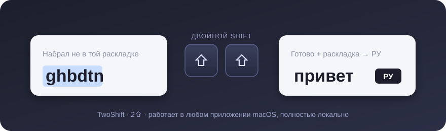

<p align="center">
  
</p>

<h1 align="center">TwoShift · 2⇧</h1>

<p align="center">
  Набрал <code>ghbdtn</code> вместо <code>привет</code>? Выдели, нажми <kbd>Shift</kbd> дважды — готово.<br>
  Утилита для строки меню macOS, которая исправляет текст, набранный не в той раскладке, и сразу переключает раскладку.
</p>

<p align="center">
  <a href="https://github.com/garshany/2Shift/releases/latest"></a>
  
  
  
</p>

<p align="center">
  
</p>

---

## Зачем это

Каждый, кто печатает на двух языках, знает эту боль: пишешь целое предложение, поднимаешь глаза — а там `Ghbdtn^ rfr ltkf?`. Стирать и набирать заново долго и обидно.

TwoShift делает то, что на Windows делал Punto Switcher, но по-маковски: без окон, без облаков и без слежки. Один жест — и текст в порядке, а системная раскладка уже стоит на нужном языке, чтобы продолжать печатать.

## Возможности

- **Конвертация в любом приложении** — TextEdit, Safari, Chrome, Telegram, VS Code, терминал: везде, где есть выделение текста.
- **Оба направления** — `ghbdtn` → `привет` и `руддщ` → `hello`. Направление определяется автоматически.
- **Знаки препинания macOS** — `Ghbdtn^ vbh& Rfr ltkf? Lf!` превращается в `Привет, мир. Как дела? Да!`.
- **Двойной Shift** — два быстрых нажатия, как в JetBrains. Плюс запасное сочетание (по умолчанию <kbd>⇧⌘Space</kbd>), которое можно перезаписать на любое с <kbd>⌘</kbd>/<kbd>⌥</kbd>/<kbd>⌃</kbd> или F-клавишей.
- **Переключение раскладки** — после конвертации система переходит на язык результата. Без выделения двойной Shift просто переключает EN ⇄ RU. Отключается одной галочкой.
- **Буфер обмена не страдает** — содержимое сохраняется и восстанавливается после вставки.
- **Полностью локально** — нет сети, нет логов, нет телеметрии. Текст живёт в буфере обмена доли секунды.
- **Русский интерфейс** — настройки, ассистент разрешений, диагностика, запуск при входе.

## Установка

1. Скачайте `TwoShift-x.y.z.dmg` из [последнего релиза](https://github.com/garshany/2Shift/releases/latest).
2. Перетащите `TwoShift.app` в `Applications` и запустите.
3. Сборка пока подписана ad-hoc (без Developer ID), поэтому macOS спросит подтверждение: **Системные настройки → Конфиденциальность и безопасность → «Всё равно открыть»**.
4. Ассистент первого запуска попросит два разрешения:
   - **Доступность** — чтобы отправлять <kbd>⌘C</kbd>/<kbd>⌘V</kbd>;
   - **Мониторинг ввода** — чтобы ловить двойной Shift глобально.
5. В строке меню появится `2⇧`. Проверьте: наберите `ghbdtn`, выделите, нажмите Shift дважды.

Подробнее — в [docs/INSTALL_RU.md](docs/INSTALL_RU.md).

## Как это работает

```
двойной Shift ──▶ ⌘C ──▶ конвертация (локально) ──▶ ⌘V ──▶ восстановить буфер ──▶ переключить раскладку
```

Слушатель клавиатуры — listen-only `CGEvent` tap: приложение ничего не перехватывает и не блокирует. Конвертер — чистая таблица соответствий символов, без словарей и эвристик, поэтому результат всегда предсказуем.

## Сборка из исходников

```bash
scripts/check_core.sh      # тесты ядра
scripts/build_app.sh       # dist/TwoShift.app
scripts/install_local.sh   # установить в /Applications
scripts/package_release.sh # DMG + ZIP + manifest
```

Требуется Xcode Command Line Tools с Swift 6. Полный релизный пайплайн (Developer ID, нотаризация) описан в [docs/PRODUCTION.md](docs/PRODUCTION.md).

## Ограничения

- Защищённые поля ввода (пароли) намеренно не поддерживаются — macOS не отдаёт их содержимое.
- Rich text вставляется как обычный текст.
- Некоторые приложения могут блокировать синтетическую вставку.

## Приватность

Нет серверов, нет аналитики, нет сети. См. [docs/PRIVACY.md](docs/PRIVACY.md).

---

<details>
<summary><b>English</b></summary>

**TwoShift** is a macOS menu bar utility that fixes text typed in the wrong keyboard layout (English ⇄ Russian) and switches the system input source to match.

Select the text, press <kbd>Shift</kbd> twice (or <kbd>⇧⌘Space</kbd>) — `ghbdtn` becomes `привет`, `руддщ` becomes `hello`, and the keyboard layout follows the result. Direction is detected automatically, the clipboard is restored afterwards, and nothing ever leaves your Mac.

Requires macOS 13+, Accessibility and Input Monitoring permissions. Build with `scripts/build_app.sh`; run core tests with `scripts/check_core.sh`.

</details>
